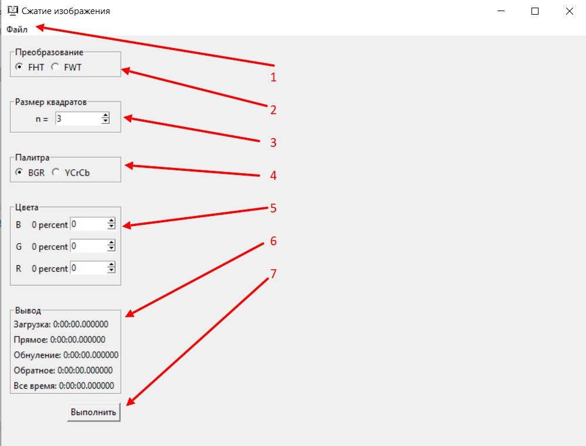

## Техническое задание
С исследованием подробнее можно ознакомиться [на моем гугл диске](https://drive.google.com/drive/u/0/folders/1obtPP8CRGXmBAwqVnQKYuf2lgKmgCR-4).

## Гид по проекту
- В папке modules содержаться модули проекта:
    - модуль algorithms содержит скрипты algorithms.py, haar.py и walsh.py, которые представляют собой реализацию двумерных быстрых преобразований Хаара и Уолша;
    - модуль app содержит скрипт app.py, который позволяет сгенерировать GUI для более простого использования программы;
    - модуль compression содержит скрипт compressing.py, созданный для непосредственного сжатия изображения;
- В папке scripts содержится скрипт main.py, который запускает GUI.

## Запуск приложения

После запуска файла main.py откроется интерфейс приложения, состоящий из следующих элементов:
1. Меню "Файл". После нажатия откроется меню, в котором можно выбрать исходное изображение и указать путь сохранения сжатого изображения.
2. Переключатель между преобразованиями.
3. Размер квадратов, на которые будет разделено изображение ().
4. Переключатель между палитрами.
5. Проценты обнуления по каждому из цветовому параметру.
6. Окно состояния. Здесь будут отображаться временные результаты вычислений.
7. Кнопка, после нажатия на которою программа начнет сжатие изображения.

Например, будем сжимать изображение при помощи быстрых преобразований Хаара путем деления исходного изображения на квадраты со стороной 8 пикселей в 90%. Сжатие происходит следующим образом: в преобразовании будем обращать в ноль 90% от всех пикселей по каждой из цветовой составляющей. Тогда получим:

